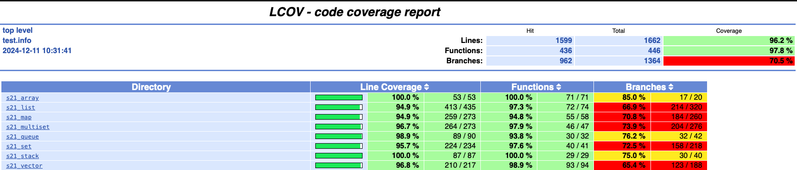

# CPP containers

Реализация библиотеки s21_containers.h.

## Contents

- [Информация](#информация)
- [Реализация базовых контейнеров](#реализация-базовых-контейнеров)
- [Реализация дополнительных контейнеров](#реализация-дополнительных-контейнеров)
- [Реализация методов `insert_many`](#реализация-методов-insert-many)
- [Спецификация](#спецификация)
- [Авторы](#авторы)

### Информация

Разработка собственной библиотеки, реализующую основные стандартные контейнерные классы языка С++: `list` (список), `map` (словарь), `queue` (очередь), `set` (множество), `stack` (стек) и `vector` (вектор). Реализации предоставляют весь набор стандартных методов и атрибутов для работы с элементами, проверкой заполненности контейнера и итерирования.

### Реализация базовых контейнеров

Список классов: `list` (список), `map` (словарь), `queue` (очередь), `set` (множество), `stack` (стек), `vector` (вектор).
- Заголовочный файл `s21_containers.h`, который включает в себя другие заголовочные файлы с реализациями необходимых контейнеров (`s21_list.h`, `s21_map.h` и т.д.);
- За основу лучше всего взять классическую реализацию контейнеров, но конечный выбор реализаций остается свободным. За исключением списка - его необходимо реализовывать через структуру списка, а не через массив.

### Реализация дополнительных контейнеров

Список классов, которые нужно реализовать дополнительно: `array` (массив), `multiset` (мультимножество).
- Заголовочный файла `s21_containersplus.h`, который включает в себя другие заголовочные файлы с реализациями необходимых контейнеров (`s21_array.h`, `s21_multiset.h`);
- За основу лучше всего взять классическую реализацию контейнеров, но конечный выбор алгоритма остается свободным.

### Реализация методов insert many

Реализация контейнеров также дополнена соответствующими методами согласно таблице:

| Modifiers      | Definition                                      | Containers |
|----------------|-------------------------------------------------| -------------------------------------------|
| `iterator insert_many(const_iterator pos, Args&&... args)`          | Inserts new elements into the container directly before `pos`.  | List, Vector. |
| `void insert_many_back(Args&&... args)`          | Appends new elements to the end of the container.  | List, Vector, Queue. |
| `void insert_many_front(Args&&... args)`          | Appends new elements to the top of the container.  | List, Stack. |
| `vector<std::pair<iterator,bool>> insert_many(Args&&... args)`          | Inserts new elements into the container.  | Map, Set, Multiset. |

## Спецификация

- Программа разработана на языке C++ стандарта C++17 с использованием компилятора gcc;
- Используются итераторы;
- Используются шаблонные классы;
- Подготовлено полное покрытие unit-тестами методов контейнерных классов c помощью библиотеки GTest;
- Запрещено копирование реализации стандартной библиотеки шаблонов (STL);
- Необходимо соблюсти логику работы стандартной библиотеки шаблонов (STL) (в части проверок, работы с памятью и поведения в нештатных ситуациях).

## Сборка

- не предусмотрена для данного проекта, предполагается подключение библиотеки через заголовочные файлы

## Юнит тесты

- перейдите в `src`
- запустите команду `make test`

```bash
[----------] Global test environment tear-down
[==========] 481 tests from 32 test suites ran. (5 ms total)
[  PASSED  ] 481 tests.
```

## LCOV report

- перейдите в `src`
- запустите `make gcov_report`



## Авторы проекта

Никнеймы шк21

- donnapoc (Святослав)
- directpi (Игорь)
